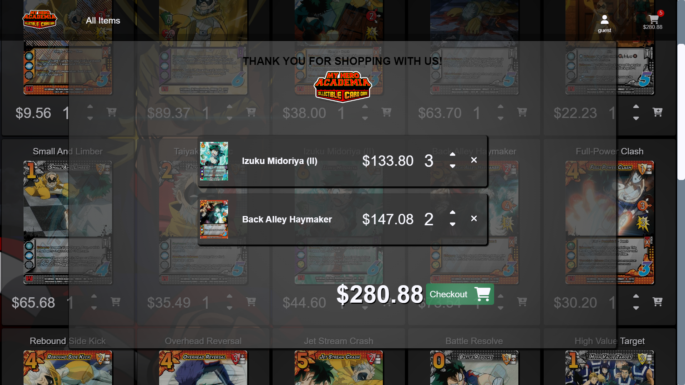

## Frontend

# ALLMIGHTY CCG

<blockquote>
This is a rough draft of an ecommerce website.  It is fully functional in test mode.  Use card number 4242-4242-4242-4242 when attempting a purchase.
The intention behind the style of the project was collectable, however with more development an admin panel will be added which can give users permissions to add remove, and change product prices</blockquote>
 

----------------------------
        
## Backend 

### Env variables
 * NODE_ENV = development or production
 * PORT=A port of your choice
 * DATABASE= mongodb database url
 * PASSWORD= mongodb database password
 * JWT_SECRET= for jwt
 * JWT_EXPIRES= length of time before jwt expiration
 * JWT_COOKIE_EXPIRES_IN= expiration for cookies
 * STRIPE_API_KEY= api key for stripe
 * EMAIL_USERNAME= EMAIL FOR PASSWORD RESET FUNCTION
 * EMAIL_PASSWORD= EMAIL FOR PASSWORD RESET FUNCTION
 * EMAIL_HOST
 * EMAIL_PORT
 

